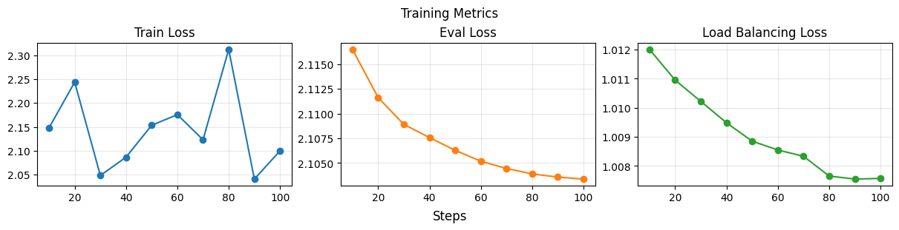
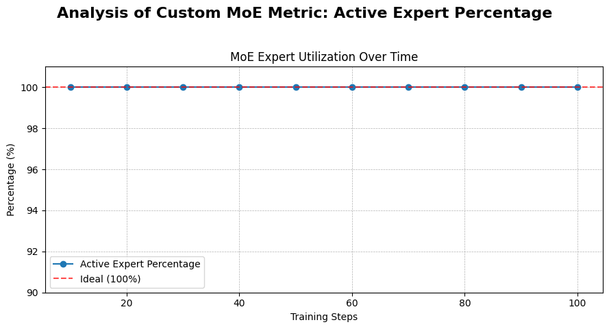
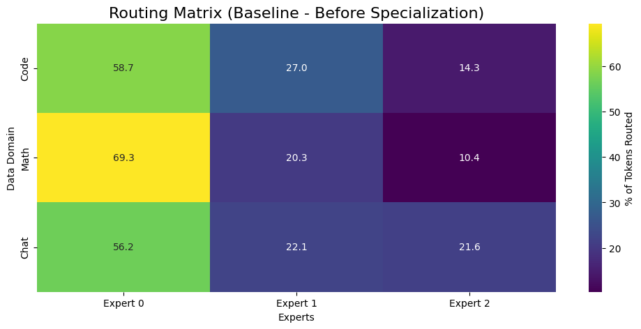
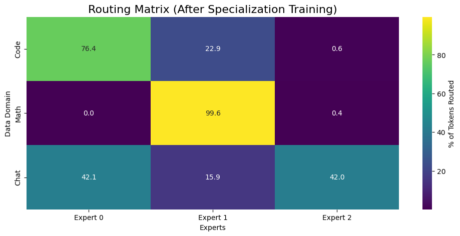
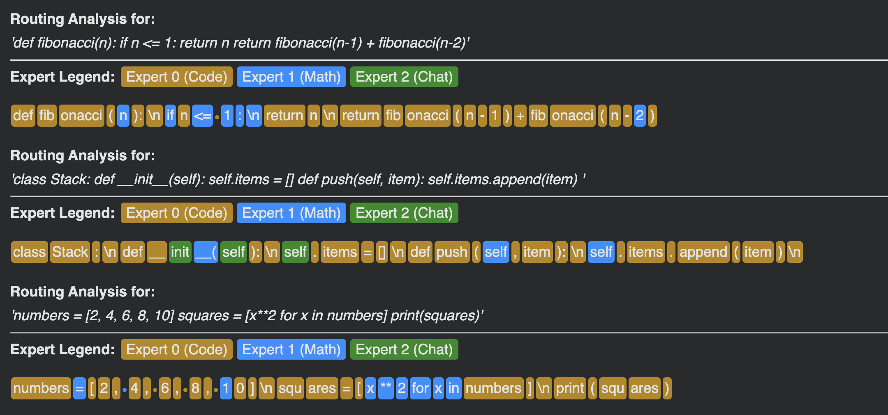

# smol-experiments 🧪

A collection of experiments exploring the lifecycle of Small Language Models (SLMs). This repository covers Supervised Fine-Tuning (SFT), Preference Optimization (DPO/CPO), and architectural evolution by Upcycling dense models into Mixture-of-Experts (MoE) with targeted expert specialization.

The experiments utilize [SmolLM-135M](https://huggingface.co/HuggingFaceTB/SmolLM-135M) as the base model.

---

## 🔬 Experiments

### 1. Alignment & Instruction Tuning
I explore methods to align a base model to follow grammatical correction instructions using the **CoEdIT** dataset.
* **SFT (Supervised Fine-Tuning):** Establishing a baseline for instruction following.
* **DPO (Direct Preference Optimization):** Optimizing using edit-distance-based preference pairs.
* **CPO (Contrastive Preference Optimization):** Exploring memory-efficient alternatives to DPO.
* *Result:* Achieved ~0.49 BLEU score with SFT+DPO.

### 2. MoE Upcycling & Continued Pre-training
I transform the dense SmolLM-135M into a **SmolMoE** (Mixture of Experts) model.
* **Upcycling:** Initializing MoE weights from the dense checkpoint using "SwiGLU" duplication.
* **Router Training:** Validated using Load Balancing Loss.
* **Continuous Pre-training:** Training on the **Cosmopedia** dataset to stabilize the upcycled model.

### 3. Expert Specialization
I force specific experts to specialize in distinct domains (Code, Math, Chat) using architectural modifications and loss guidance.
* **Dataset:** Interleaved subsets from `Llama-Nemotron-Post-Training-Dataset`.
* **Methodology:**
    1.  **Router Guidance Loss:** KL Divergence loss forcing tokens from specific domains to specific experts.
    2.  **Two-Stage Training:** * *Stage A:* Freeze model, warm-start router with high guidance.
        * *Stage B:* Joint tuning of router and experts.
* *Result:* Achieved >90% routing accuracy for Math tokens to the Math Expert.

---

## 📊 Results & Analysis

### MoE Utilization and Stability

This plot shows the stabilization of training metrics during continued pre-training on the Cosmopedia dataset.


This plot tracks the percentage of active experts over time, confirming the router successfully avoided collapse.


### Expert Routing Matrix

**Routing Before Specialization**
This visualization shows the initial, unspecialized distribution of tokens across experts.


**Routing After Specialization**
This visualization confirms the successful specialization of experts after targeted training.


**Token-Level Routing Detail**
A granular analysis demonstrating the model correctly routing individual tokens based on domain context.


---

## 📂 Project Structure

* `src/`: Core model architectures (Dense & MoE), data processing, and custom trainers.
* `scripts/`: Executable Python scripts for running full training pipelines.
* `notebooks/`: Visualizations, routing heatmaps, and evaluation walkthroughs.
* `viz/`: Contains all visualization assets.

---

## 🚀 Getting Started

### Installation
```bash
git clone [https://github.com/yourusername/smol-experiments.git](https://github.com/yourusername/smol-experiments.git)
cd smol-experiments
pip install -r requirements.txt