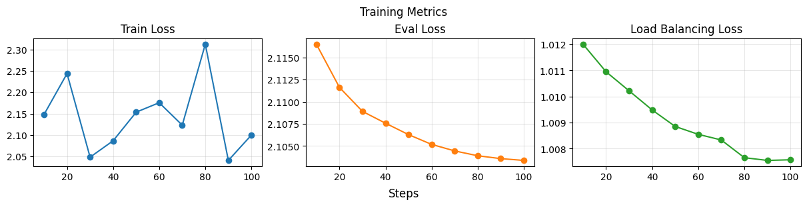
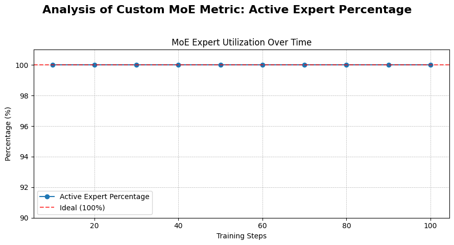
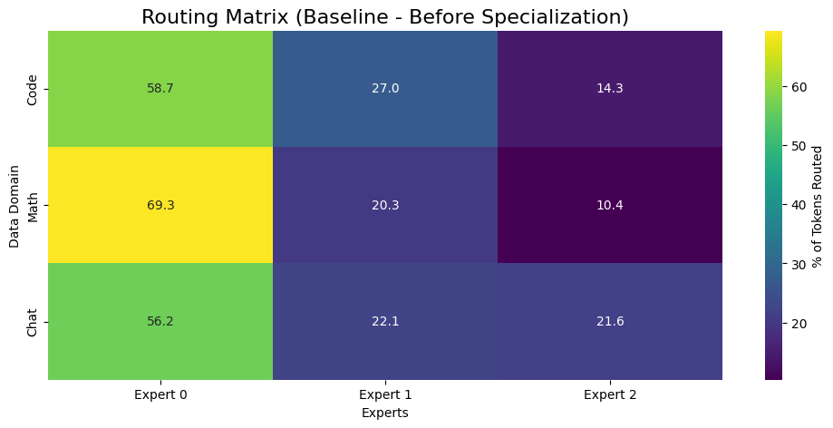
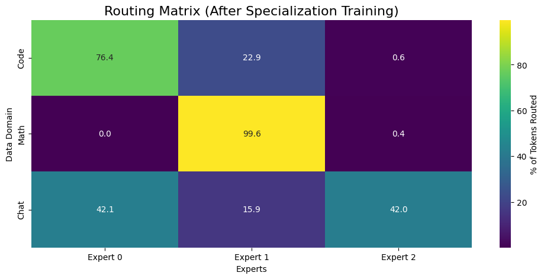
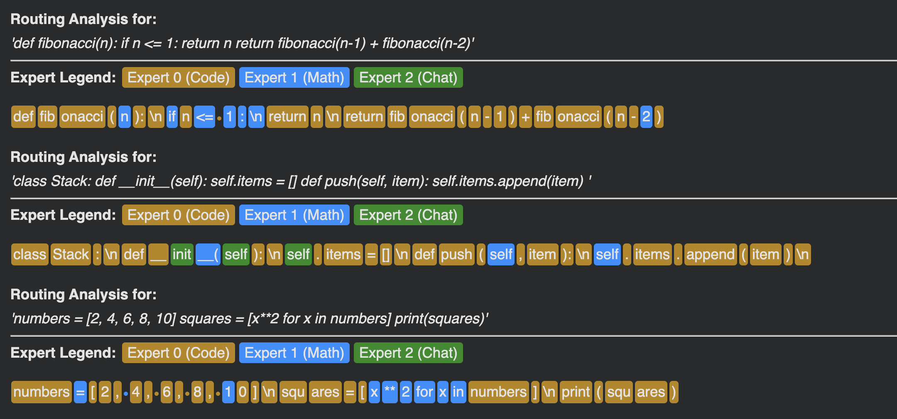
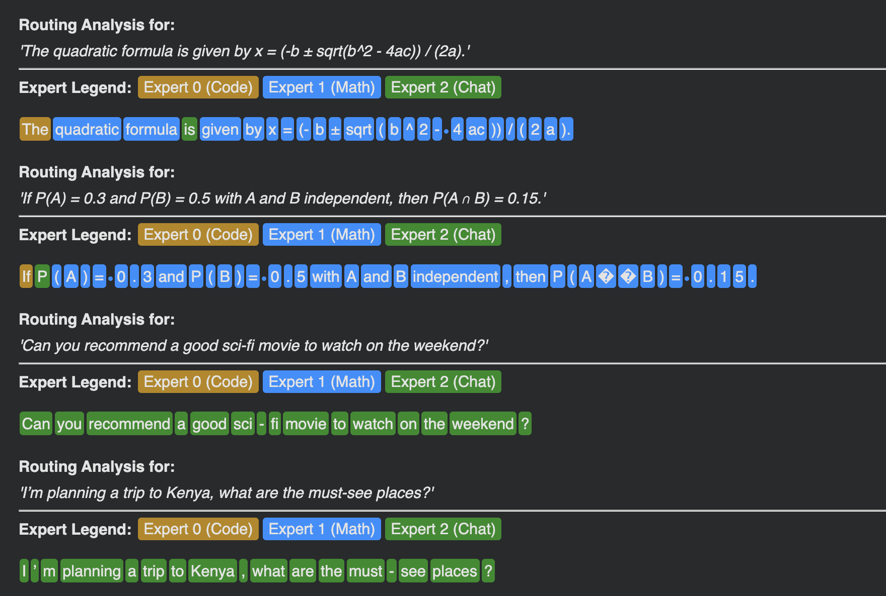

# smol-experiments

Compute-friendly experiments for learning how small language models are trained,
aligned, converted, and analyzed. This is intentionally a workbench, not one
mandatory end-to-end pipeline: each numbered script is a runnable experiment,
and related scripts form short tracks that can be studied independently on
modest hardware.

The current experiments use
[HuggingFaceTB/SmolLM-135M](https://huggingface.co/HuggingFaceTB/SmolLM-135M)
as the base model.

<details open>
<summary><strong>Experiment Tracks</strong></summary>

- **Alignment and instruction tuning:** SFT, DPO, and CPO on CoEdIT grammatical
  error correction.
- **MoE upcycling and continued pretraining:** convert the dense model into a
  3-expert Mixture-of-Experts and continue training on Cosmopedia.
- **Expert specialization:** nudge the MoE router toward Code, Math, and Chat
  experts, then analyze whether routing actually specializes.
- **Visualization:** generate HTML dashboards for training metrics and routing
  behavior.

</details>

## Results Preview

The screenshots below render directly on GitHub. The HTML dashboards are also
committed for local viewing or GitHub Pages:

- [Training dashboard](viz/training_dashboard.html)
- [Routing dashboard](viz/routing_dashboard.html)

Training curves and expert usage:

<p>
  <a href="viz/continued_pretaining.png"></a>
  <a href="viz/active_experts.png"></a>
</p>

Routing before and after specialization:

<p>
  <a href="viz/routing_before_specialization.png"></a>
  <a href="viz/routing_after_specialization.png"></a>
</p>

Token-level routing examples:

<p>
  <a href="viz/token_routing_analysis.png"></a>
</p>

<p>
  <a href="viz/token_routing_analysis_2.png"></a>
</p>

<details>
<summary><strong>Repository Structure</strong></summary>

```text
smol-experiments/
├── scripts/
│   ├── 01_train_sft.py
│   ├── 02_train_dpo.py
│   ├── 03_train_cpo.py
│   ├── 04_upcycle_to_moe.py
│   ├── 05_train_moe_pretraining.py
│   ├── 06_train_specialization.py
│   ├── 07_analyze_routing.py
│   ├── 08_plot_metrics.py
│   ├── modal_artifacts.py
│   └── run_experiment.py
├── src/
│   ├── data/
│   ├── models/
│   ├── checkpoint.py
│   ├── evaluation.py
│   ├── losses.py
│   ├── metrics.py
│   ├── upcycling.py
│   ├── utils.py
│   └── visualization.py
├── tests/
├── outputs/        # generated checkpoints and metrics, ignored by git
├── notebooks/      # exploratory notebooks kept for reference
├── viz/            # shareable visualization artifacts
├── pyproject.toml
└── README.md
```

</details>

<details>
<summary><strong>Setup</strong></summary>

This repo uses `uv` as the primary environment manager.

```bash
uv sync --group dev
```

Datasets and base models download automatically from the Hugging Face Hub on
first run. `requirements.txt` is kept as a pip fallback, but `pyproject.toml`
is the source of truth for dependency changes.

For optional Modal support:

```bash
uv sync --group dev --group modal
modal setup
```

</details>

<details>
<summary><strong>Run Locally</strong></summary>

Run commands from the repo root. Every script exposes its important settings
through `argparse`, so `--help` is usually the fastest way to inspect options.

```bash
uv run python scripts/01_train_sft.py
uv run python scripts/02_train_dpo.py
uv run python scripts/03_train_cpo.py
uv run python scripts/04_upcycle_to_moe.py
uv run python scripts/05_train_moe_pretraining.py
uv run python scripts/06_train_specialization.py
uv run python scripts/07_analyze_routing.py
uv run python scripts/08_plot_metrics.py
```

Recommended tracks:

- **GEC alignment:** `01 -> 02` and/or `03`
- **MoE:** `04 -> 05 -> 06 -> 07 -> 08`

Small smoke-test examples:

```bash
uv run python scripts/05_train_moe_pretraining.py --steps 10 --max-samples 100
uv run python scripts/06_train_specialization.py --steps 50 --max-samples-per-domain 50
uv run python scripts/07_analyze_routing.py --layer-idx 12
```

</details>

<details>
<summary><strong>SFT and DPO</strong></summary>

The alignment track fine-tunes SmolLM on CoEdIT grammatical error correction.
SFT uses completion-only loss with this prompt/completion shape:

```text
{source sentence}
Correction: {corrected sentence}<eos>
```

After SFT, DPO builds preference pairs by sampling two candidate corrections
and choosing the one closer to the reference by edit distance. Evaluation uses
greedy decoding and reports GLEU, BLEU, copy rate, empty-output rate, and edit
distance.

A short-prompt SFT run:

```bash
uv run python scripts/01_train_sft.py \
  --output-dir outputs/sft_short_128 \
  --max-seq-length 512 \
  --max-train-input-tokens 128 \
  --max-train-tokens 512 \
  --max-eval-input-tokens 128 \
  --eval-max-input-length 128 \
  --eval-output outputs/sft_eval_predictions_short_128.csv
```

Matching DPO run:

```bash
uv run python scripts/02_train_dpo.py \
  --sft-checkpoint outputs/sft_short_128 \
  --output-dir outputs/dpo_short_128 \
  --max-length 512 \
  --max-prompt-length 128 \
  --max-preference-input-tokens 128 \
  --max-eval-input-tokens 128 \
  --eval-max-input-length 128 \
  --rebuild-preference-dataset \
  --preference-dataset-dir outputs/preference_dataset_short_128 \
  --eval-output outputs/dpo_eval_predictions_short_128.csv
```

</details>

<details>
<summary><strong>MoE Experiments</strong></summary>

The MoE track starts from the base dense SmolLM checkpoint and is independent
of the GEC alignment track.

```bash
uv run python scripts/04_upcycle_to_moe.py
uv run python scripts/05_train_moe_pretraining.py --steps 1500
uv run python scripts/06_train_specialization.py --steps 1500
uv run python scripts/07_analyze_routing.py
```

The current specialization objective is:

```text
causal_lm_loss + (0.01 * load_balancing_loss) + (0.01 * specialization_loss)
```

Routing analysis compares the pretrained and specialized MoE on held-out
domain data and writes routing tables plus token-level expert assignments.

</details>

<details>
<summary><strong>Visualizations</strong></summary>

Custom-loop scripts write CSV metrics under `outputs/`. Build a self-contained
HTML training dashboard with:

```bash
uv run python scripts/08_plot_metrics.py
```

Default output:

```text
outputs/training_dashboard.html
```

Routing analysis writes:

```text
outputs/routing_analysis/routing_dashboard.html
outputs/routing_analysis/routing_before.csv
outputs/routing_analysis/routing_after.csv
outputs/routing_analysis/domain_losses.csv
outputs/routing_analysis/token_routing.csv
```

These HTML files are static, so they can be opened locally or published through
GitHub Pages if copied into a docs/site directory.

Committed dashboard examples:

- [Training dashboard](viz/training_dashboard.html)
- [Routing dashboard](viz/routing_dashboard.html)

</details>

<details>
<summary><strong>Modal Runs</strong></summary>

Local runs are the default. Use the wrapper when you want to run the same
numbered scripts on Modal GPUs.

Dry run:

```bash
uv run --group modal python scripts/run_experiment.py \
  --backend modal --gpu A100 --dry-run \
  scripts/05_train_moe_pretraining.py -- --steps 100 --max-samples 1000
```

Launch:

```bash
uv run --group modal python scripts/run_experiment.py \
  --backend modal --gpu A100 \
  scripts/05_train_moe_pretraining.py -- --steps 100 --max-samples 1000
```

Use `--backend auto` to try Modal and fall back to local execution when Modal
is unavailable.

Artifacts are stored in a Modal Volume named `smol-experiments-outputs` by
default. List or pull them with:

```bash
uv run --group modal python scripts/modal_artifacts.py list
uv run --group modal python scripts/modal_artifacts.py pull
```

</details>

<details>
<summary><strong>Tests</strong></summary>

The test suite is intentionally small and fast: model shape checks, loss
masking behavior, checkpoint round trips, routing helpers, and script utility
coverage.

```bash
uv run pytest
```

</details>

<details>
<summary><strong>Hardware</strong></summary>

The project can run on CPU, Apple Silicon MPS, and CUDA GPUs. CPU works but is
slow; MPS is useful for local experiments on Apple Silicon; CUDA is preferred
for longer runs.

Precision is auto-detected:

| Hardware | dtype |
| --- | --- |
| Ampere+ GPU | bfloat16 |
| Older CUDA GPU, such as T4 | float16 with GradScaler |
| Apple Silicon MPS | float32 |
| CPU | float32 |

</details>

<details>
<summary><strong>Design Notes</strong></summary>

- TRL is used for SFT, DPO, and CPO because those are standard alignment
  recipes.
- The MoE model is implemented locally because upcycling, router losses, and
  expert analysis need direct control of the forward pass.
- MoE routing is top-1 and unscaled: the chosen expert output is not multiplied
  by the router probability. This keeps the upcycled MoE close to the dense
  model before auxiliary router training.
- Training scripts are resumable. TRL scripts rely on trainer checkpoints;
  custom-loop scripts save model, optimizer, scaler, RNG state, and step.
- MoE checkpoints bundle model config with weights so downstream scripts can
  rebuild the saved architecture without assuming defaults.

</details>
